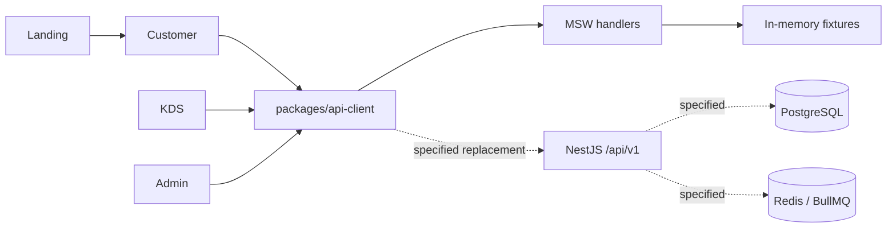
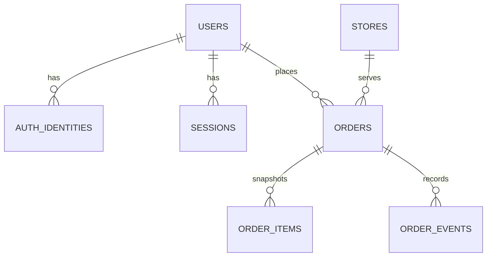
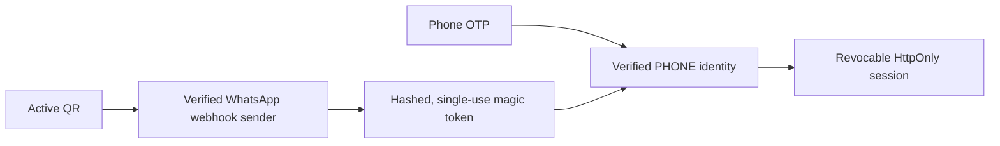
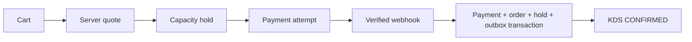

# 1. Quick Start

```powershell
corepack enable
pnpm install --frozen-lockfile
'landing','customer','kds','admin' | ForEach-Object { Copy-Item "apps/$_/.env.example" "apps/$_/.env" }
pnpm dev
pnpm test
pnpm lint
pnpm typecheck
pnpm build
```

⚠️ Gotcha: These commands run four frontend apps and MSW mocks. This checkout has no backend process or database. See [package.json](../package.json), [apps/customer/src/app/start-mocks.ts](../apps/customer/src/app/start-mocks.ts) and [README.md](../README.md).

Printable flow-first companion: [Pizza Avenue backend guide](../output/pdf/pizza-avenue-backend-guide.pdf).

## Contents

| Section | Section | Section | Section |
|---|---|---|---|
| [1 Quick Start](#1-quick-start) | [2 Overview & architecture](#2-overview--architecture) | [3 Setup & env vars](#3-setup--env-vars) | [4 Folder structure](#4-folder-structure) |
| [5 Database](#5-database) | [6 API reference](#6-api-reference) | [7 Auth & permissions](#7-auth--permissions) | [8 Business logic](#8-business-logic) |
| [9 Error handling & logging](#9-error-handling--logging) | [10 Performance](#10-performance) | [11 Security checklist](#11-security-checklist) | [12 Testing](#12-testing) |
| [13 Deployment](#13-deployment) | [14 Integrations](#14-integrations) | [15 Troubleshooting](#15-troubleshooting) | [16 Gaps & Recommendations](#16-gaps--recommendations) |

## Find it fast

| Task | Go to |
|---|---|
| Run the local prototype or turn mocks off | [1 Quick Start](#1-quick-start), [3 Setup](#3-setup--env-vars) |
| Add or change an endpoint | [6 API reference](#6-api-reference), [12 Testing](#12-testing) |
| Change a data contract or future table | [5 Database](#5-database), [16 Gaps](#16-gaps--recommendations) |
| Work on login or staff access | [7 Auth & permissions](#7-auth--permissions), [11 Security](#11-security-checklist) |
| Implement checkout, payment, KDS or loyalty | [8 Business logic](#8-business-logic), [12 Testing](#12-testing) |
| Diagnose an API failure | [9 Errors](#9-error-handling--logging), [15 Troubleshooting](#15-troubleshooting) |
| Configure production or a provider | [13 Deployment](#13-deployment), [14 Integrations](#14-integrations) |
| Find unbuilt requirements | [16 Gaps & Recommendations](#16-gaps--recommendations) |

**Status key:** **Implemented** = executable code in this checkout; **Mocked** = MSW response or in-memory state; **Specified** = requirement in `/docs`, with no server implementation; **TODO: confirm** = source does not settle the detail. A passing mock test is not proof that a server requirement is met.

**Authority:** Requirements follow [docs/16_DECISIONS.md](16_DECISIONS.md) → [docs/02_BUSINESS_RULES.md](02_BUSINESS_RULES.md) → [docs/01_PRODUCT_SCOPE.md](01_PRODUCT_SCOPE.md) → [docs/09_STATE_MACHINES.md](09_STATE_MACHINES.md) → [docs/08_DATA_MODEL.md](08_DATA_MODEL.md) → [docs/10_API_CONTRACTS.md](10_API_CONTRACTS.md) → [docs/03_ROLES_PERMISSIONS.md](03_ROLES_PERMISSIONS.md) → [docs/21_DEPLOYMENT_ARCHITECTURE.md](21_DEPLOYMENT_ARCHITECTURE.md). Implementation status comes from code. Conflicts are called out, not silently reconciled. Source: [AGENTS.md](../AGENTS.md).

# 2. Overview & architecture

**Summary:** The running repository is a pnpm frontend workspace with a typed HTTP boundary and MSW; the NestJS modular monolith is a V1 requirement.

| Layer | Current state | Source / requirement |
|---|---|---|
| Apps | **Implemented:** Landing, Customer, KDS and Admin React 19/Vite/TypeScript apps; Counter is intended inside KDS. | [apps/customer/package.json](../apps/customer/package.json), [apps/kds/src/app/router.tsx](../apps/kds/src/app/router.tsx), [README.md](../README.md) |
| Client transport | **Implemented:** `apiRequest` builds URLs, sends cookies with `credentials: 'include'`, sets JSON content type for bodies, normalizes failures. | [packages/api-client/src/client.ts](../packages/api-client/src/client.ts), [packages/api-client/src/errors.ts](../packages/api-client/src/errors.ts) |
| Local API behavior | **Mocked:** 27 MSW handlers at `/api/v1`; fixture/scenario state is in memory. | `packages/mocks/src/handlers/`, [packages/mocks/src/scenarios/index.ts](../packages/mocks/src/scenarios/index.ts) |
| Server | **Specified:** Node.js LTS, NestJS modular monolith, REST/JSON/OpenAPI, WebSocket live updates. No `server/` or API app exists. | [docs/16_DECISIONS.md](16_DECISIONS.md), [docs/10_API_CONTRACTS.md](10_API_CONTRACTS.md) |
| Persistence and jobs | **Specified:** Prisma/PostgreSQL, Redis/BullMQ, transactional outbox. No schema, migration, worker or queue runtime exists. | [docs/08_DATA_MODEL.md](08_DATA_MODEL.md), [docs/11_INTEGRATIONS.md](11_INTEGRATIONS.md) |
| Production edge | **Implemented:** frontend Dockerfile, five-service Compose file and Caddy host routing. API upstream is configured but no API service exists. | [Dockerfile.frontend](../Dockerfile.frontend), [compose.yaml](../compose.yaml), [infra/caddy/Caddyfile](../infra/caddy/Caddyfile) |



| Decision | Why it matters | Source |
|---|---|---|
| Pickup only, one store in V1 | No delivery, address, driver or marketplace endpoint should be inferred. | [docs/01_PRODUCT_SCOPE.md](01_PRODUCT_SCOPE.md), [docs/16_DECISIONS.md](16_DECISIONS.md) |
| Backend owns money and state | Client prices are provisional; payment UI cannot confirm an order. | [docs/02_BUSINESS_RULES.md](02_BUSINESS_RULES.md), [docs/16_DECISIONS.md](16_DECISIONS.md) |
| Integer paise | JSON `Money` is `{ "amount": 34900, "currency": "INR" }` for ₹349.00. | [packages/types/src/money.ts](../packages/types/src/money.ts), [packages/utils/src/money.ts](../packages/utils/src/money.ts), [docs/16_DECISIONS.md](16_DECISIONS.md) |
| PostgreSQL truth, outbox with critical writes | Queue/socket delivery must be recoverable and idempotent when implemented. | [docs/16_DECISIONS.md](16_DECISIONS.md), [docs/11_INTEGRATIONS.md](11_INTEGRATIONS.md) |
| Separate hosts | Root Landing; Customer `app`, KDS `kds`, Admin `admin`, API `api` subdomains. | [docs/16_DECISIONS.md](16_DECISIONS.md), [infra/caddy/Caddyfile](../infra/caddy/Caddyfile) |

# 3. Setup & env vars

**Summary:** Only public Vite URLs, a mock switch and Caddy domain placeholders are configured in code; no backend secrets are configured here.

| Name | Purpose | Required | Example placeholder | Source |
|---|---|---|---|---|
| `VITE_APP_ENV` | Select local/development URL defaults. | Outside local: URL behavior depends on explicit URLs. | `local` | [packages/config/src/index.ts](../packages/config/src/index.ts), [apps/customer/.env.example](../apps/customer/.env.example) |
| `VITE_LANDING_URL` | Landing origin. | Staging/production | `https://pizzaavenue.example.com` | [packages/config/src/index.ts](../packages/config/src/index.ts), [apps/customer/.env.example](../apps/customer/.env.example) |
| `VITE_CUSTOMER_APP_URL` | Customer origin. | Staging/production | `https://app.pizzaavenue.example.com` | Same |
| `VITE_KDS_URL` | KDS origin. | Staging/production | `https://kds.pizzaavenue.example.com` | Same |
| `VITE_ADMIN_URL` | Admin origin. | Staging/production | `https://admin.pizzaavenue.example.com` | Same |
| `VITE_API_BASE_URL` | HTTP API base; local default `http://localhost:3000/api/v1`. | Staging/production | `https://api.pizzaavenue.example.com/api/v1` | [packages/config/src/index.ts](../packages/config/src/index.ts), [apps/customer/.env.example](../apps/customer/.env.example) |
| `VITE_ENABLE_MOCKS` | Exact string `false` skips MSW in Customer/KDS/Admin. | No; mocks otherwise start. | `true` | [apps/customer/src/app/start-mocks.ts](../apps/customer/src/app/start-mocks.ts), [apps/kds/src/app/start-mocks.ts](../apps/kds/src/app/start-mocks.ts), [apps/admin/src/app/start-mocks.ts](../apps/admin/src/app/start-mocks.ts) |
| `LANDING_DOMAIN` | Caddy Landing host. | Compose deployment | `pizzaavenue.example.com` | [infra/docker/.env.example](../infra/docker/.env.example), [infra/caddy/Caddyfile](../infra/caddy/Caddyfile) |
| `CUSTOMER_DOMAIN` | Caddy Customer host. | Compose deployment | `app.pizzaavenue.example.com` | Same |
| `KDS_DOMAIN` | Caddy KDS host. | Compose deployment | `kds.pizzaavenue.example.com` | Same |
| `ADMIN_DOMAIN` | Caddy Admin host. | Compose deployment | `admin.pizzaavenue.example.com` | Same |
| `API_DOMAIN` | Caddy API host; its upstream is absent. | Caddy configuration | `api.pizzaavenue.example.com` | Same |

```powershell
Copy-Item infra/docker/.env.example infra/docker/.env
docker compose --env-file infra/docker/.env config
```

```dotenv
VITE_APP_ENV=local
VITE_API_BASE_URL=http://localhost:3000/api/v1
VITE_ENABLE_MOCKS=true
```

Use the public Vite values in `apps/customer/.env` (and the equivalent KDS/Admin files). This is a local mock configuration, not a server secret file.

⚠️ Gotcha: `VITE_*` values are public build-time inputs, not secret storage. [infra/docker/.env.example](../infra/docker/.env.example) contains placeholder hostnames. [docs/22_GIT_GITHUB_WORKFLOW_RULES.md](22_GIT_GITHUB_WORKFLOW_RULES.md) lists future server-secret examples, but no server reads them in this checkout.

💡 Tip: `createSurfaceConfig` supplies local URL defaults and throws for missing nonlocal URLs. On this branch it recognizes `localhost` (not `127.0.0.1`) from the origin unless `VITE_APP_ENV` is `local` or `development`: [packages/config/src/index.ts](../packages/config/src/index.ts).

# 4. Folder structure

**Summary:** Backend work currently lives in shared packages and mock handlers; the server and data layers are absent.

```text
apps/
  landing/                 public root-domain app
  customer/src/app/        client bootstrap, routes, query defaults, MSW startup
  kds/src/app/             KDS routes/query provider, MSW startup
  admin/src/app/           Admin route shell/query provider, MSW startup
packages/
  api-client/src/          typed /api/v1 calls, transport and error handling
  types/src/               shared DTO-like TypeScript contracts
  mocks/src/handlers/      27 MSW route handlers
  mocks/src/data/          sample customers, menu, commerce and orders
  mocks/src/scenarios/     switchable in-memory responses
  utils/src/               paise formatting, order transitions, query keys
infra/caddy/               Caddy edge and SPA fallback configs
infra/docker/.env.example  placeholder Compose hostnames
compose.yaml               Caddy + four frontend services only
.github/workflows/ci.yml   install, lint, typecheck, tests, build
docs/                     V1 requirements and decisions
```

| Missing runtime directory | State | Requirement source |
|---|---|---|
| NestJS server, worker, Prisma schema/migrations | **Specified**, absent | [docs/15_BUILD_PLAN.md](15_BUILD_PLAN.md), [docs/08_DATA_MODEL.md](08_DATA_MODEL.md), [docs/21_DEPLOYMENT_ARCHITECTURE.md](21_DEPLOYMENT_ARCHITECTURE.md) |

# 5. Database

**Summary:** There is no database connection, Prisma schema, migration or index in this checkout; the following is a specified model, not a deployed schema.



**Diagram status:** **Specified** relationships selected from [docs/08_DATA_MODEL.md](08_DATA_MODEL.md); none is a migrated table. The current in-memory contract shapes are in `packages/types/src/` and fixtures in `packages/mocks/src/data/`.

| Domain | Specified entities | Key rule / index requirement | State |
|---|---|---|---|
| Identity | `users`, `auth_identities`, `sessions`, `otp_challenges`, `magic_login_tokens`, RBAC tables | Unique `(provider, provider_identifier)`; token hashes; revocable sessions. | **Specified**: [docs/08_DATA_MODEL.md](08_DATA_MODEL.md) |
| Store/pickup | `stores`, hours/overrides, capacity rules, reservations | Race-safe capacity; reservation `HELD → CONSUMED/RELEASED/EXPIRED`. | **Specified**: [docs/02_BUSINESS_RULES.md](02_BUSINESS_RULES.md), [docs/08_DATA_MODEL.md](08_DATA_MODEL.md) |
| Menu/cart | Categories, products, variants, modifiers/applicability, carts/items | Revalidate availability/configuration and quote on server. | **Specified**: [docs/08_DATA_MODEL.md](08_DATA_MODEL.md) |
| Orders/payments | Orders, line snapshots, events, attempts, transactions, refunds, webhooks | Unique provider event/transaction and idempotency keys; immutable purchased lines. | **Specified**: [docs/08_DATA_MODEL.md](08_DATA_MODEL.md), [docs/02_BUSINESS_RULES.md](02_BUSINESS_RULES.md) |
| Loyalty/growth | Ledger, rewards, Passport progress, promotions, QR sources | One earn/progress per qualifying order; unique QR code and qualifying pair. | **Specified**: [docs/08_DATA_MODEL.md](08_DATA_MODEL.md) |
| Platform | Audit, integration, analytics and outbox events | Commit critical state and outbox row in one transaction; deduplicate consumers. | **Specified**: [docs/08_DATA_MODEL.md](08_DATA_MODEL.md), [docs/16_DECISIONS.md](16_DECISIONS.md) |

| Migration/index inventory | Result |
|---|---|
| Prisma schema or migration files | None in this checkout. |
| Physical tables or indexes | None can be confirmed from code. |
| Seed database | None; `packages/mocks/src/data/` is in-memory fixture data. |

⚠️ Gotcha: [packages/types/src/order.ts](../packages/types/src/order.ts) includes source values reserved for future integrations. Those strings do not imply existing adapters, tables or ingestion flows.

# 6. API reference

**Summary:** The 27 endpoints below are **Mocked** MSW routes with typed client calls; there is no listening `/api/v1` server.

The tables use the same columns for every route. **Auth** shows mock enforcement / required audience; `none / customer`, for example, means MSW checks no session while the V1 requirement needs customer access. **Response** is a compact JSON field excerpt when the full fixture is large; follow the linked type and handler for the complete shape. **Errors** lists explicit mock responses only; transport fallback codes are in [Section 9](#9-error-handling--logging). Path variables use braces here; client code interpolates them without URL encoding.

⚠️ Gotcha: Browser MSW intercepts application requests. A terminal `curl` request bypasses MSW and needs a real server, which this checkout does not provide. This command is a contract example for use when an API server exists:

```bash
API_BASE=http://localhost:3000/api/v1
curl -i "$API_BASE/stores/sainikpuri/menu"
```

## 6.1 Auth

**Summary:** Auth handlers return fixture customers/sessions; they validate neither OTP nor magic token and set no cookie. Source: [packages/api-client/src/auth.ts](../packages/api-client/src/auth.ts), [packages/mocks/src/handlers/auth.ts](../packages/mocks/src/handlers/auth.ts).

| Method + path | Auth (mock / required) | Params | Request example | Response example | Explicit mock errors |
|---|---|---|---|---|---|
| `POST /auth/otp/request` | none / public | Body `phone` | `{"phone":"+919000000001"}` | `{"accepted":true}` | None |
| `POST /auth/otp/verify` | none / public | Body `phone`, `otp` | `{"phone":"+919000000001","otp":"123456"}` | `{"customer":{"id":"customer-arjun"},"session":{"id":"mock-session","authMethod":"PHONE_OTP"}}` (excerpt) | None |
| `POST /auth/magic/consume` | none / public | Body `token` | `{"token":"example-one-time-token"}` | `{"customer":{"id":"customer-arjun"},"session":{"id":"mock-session","authMethod":"WHATSAPP_QR_MAGIC_LINK"}}` (excerpt) | None |
| `POST /auth/logout` | none / current session | None | No body | HTTP `204`, empty body | None |

## 6.2 Menu

**Summary:** Menu/product handlers read fixtures; sold-out scenario changes only the first menu product response. Source: [packages/api-client/src/menu.ts](../packages/api-client/src/menu.ts), [packages/mocks/src/handlers/menu.ts](../packages/mocks/src/handlers/menu.ts), [packages/mocks/src/data/menu.ts](../packages/mocks/src/data/menu.ts).

| Method + path | Auth (mock / required) | Params | Request example | Response example | Explicit mock errors |
|---|---|---|---|---|---|
| `GET /stores/{storeId}/menu` | none / public | Path `storeId` | `/stores/sainikpuri/menu` | `{"storeId":"sainikpuri","version":"mock-menu-1"}` (excerpt) | None |
| `GET /products/{productId}` | none / public | Path `productId` | `/products/pizza-avenue-signature` | `{"id":"pizza-avenue-signature","name":"Avenue Signature"}` (excerpt) | `404 NOT_FOUND` |

## 6.3 Cart and quote

**Summary:** One module-level cart is shared by all mock requests; quote returns a fixed fixture instead of recalculating. Source: [packages/api-client/src/cart.ts](../packages/api-client/src/cart.ts), [packages/mocks/src/handlers/cart.ts](../packages/mocks/src/handlers/cart.ts), [packages/mocks/src/data/commerce.ts](../packages/mocks/src/data/commerce.ts).

| Method + path | Auth (mock / required) | Params | Request example | Response example | Explicit mock errors |
|---|---|---|---|---|---|
| `POST /carts` | none / customer or guest session | Body `storeId` | `{"storeId":"sainikpuri"}` | `{"id":"cart-mock-1","status":"ACTIVE","items":[]}` (excerpt) | None |
| `GET /carts/{cartId}` | none / cart owner | Path `cartId` | `/carts/cart-mock-1` | `{"id":"cart-mock-1","items":[]}` (excerpt) | None |
| `POST /carts/{cartId}/items` | none / cart owner | Path `cartId`; body `CartItem` without `id` | `{"productId":"pizza-diavola","variantId":"pizza-diavola-regular","quantity":1,"selectedModifiers":[],"productNameSnapshot":"Diavola","variantNameSnapshot":"Regular","notes":null,"provisionalUnitPrice":{"amount":44900,"currency":"INR"}}` | `{"id":"cart-mock-1","items":[{"id":"cart-item-1"}]}` (excerpt) | None |
| `PATCH /carts/{cartId}/items/{itemId}` | none / cart owner | Path `cartId`, `itemId`; partial `CartItem` | `{"quantity":2}` | `{"id":"cart-mock-1","items":[{"id":"cart-item-1","quantity":2}]}` (excerpt) | None |
| `DELETE /carts/{cartId}/items/{itemId}` | none / cart owner | Path `cartId`, `itemId` | `/carts/cart-mock-1/items/cart-item-1` | `{"id":"cart-mock-1","items":[]}` (excerpt) | None |
| `POST /carts/{cartId}/quote` | none / cart owner | Path `cartId` | No body | `{"cartId":"cart-mock-1","payableTotal":{"amount":44900,"currency":"INR"},"version":"quote-1"}` (excerpt) | None |

⚠️ Gotcha: Cart path IDs are ignored by mock lookups, and item bodies are cast rather than validated. The fixed quote can disagree with the mutated cart; server pricing is still **Specified** in [docs/02_BUSINESS_RULES.md](02_BUSINESS_RULES.md).

## 6.4 Pickup

**Summary:** Scenarios change reported slot capacity; only the `PICKUP_FULL` scenario makes reservation creation fail. Source: [packages/api-client/src/pickup.ts](../packages/api-client/src/pickup.ts), [packages/mocks/src/handlers/pickup.ts](../packages/mocks/src/handlers/pickup.ts).

| Method + path | Auth (mock / required) | Params | Request example | Response example | Explicit mock errors |
|---|---|---|---|---|---|
| `GET /stores/{storeId}/pickup-options` | none / public | Path `storeId` | `/stores/sainikpuri/pickup-options` | `{"asap":{"id":"slot-asap","state":"AVAILABLE"},"scheduled":[{"id":"slot-1430"}]}` (excerpt) | None |
| `POST /pickup/reservations` | none / customer or guest session | Body `cartId`, `slotId`, `pickupType`, `reservedCapacityUnits` | `{"cartId":"cart-mock-1","slotId":"slot-asap","pickupType":"ASAP","reservedCapacityUnits":1}` | `201 {"id":"reservation-mock-1","status":"HELD","cartId":"cart-mock-1"}` (excerpt) | `409 SLOT_FULL` |

## 6.5 Payments

**Summary:** Payment creation returns an immediate scenario result; no provider attempt, webhook or database transaction runs. Source: [packages/api-client/src/payments.ts](../packages/api-client/src/payments.ts), [packages/mocks/src/handlers/payments.ts](../packages/mocks/src/handlers/payments.ts), [packages/mocks/src/data/commerce.ts](../packages/mocks/src/data/commerce.ts).

| Method + path | Auth (mock / required) | Params | Request example | Response example | Explicit mock errors |
|---|---|---|---|---|---|
| `POST /payments` | none / customer | Header `Idempotency-Key`; body `cartId` | Header `Idempotency-Key: example-key`; `{"cartId":"cart-mock-1"}` | `201 {"id":"payment-mock-1","status":"SUCCESS","orderId":"order-pa-1001"}` (excerpt) | None |
| `GET /payments/{paymentId}` | none / payment owner | Path `paymentId` | `/payments/payment-mock-1` | `{"id":"payment-mock-1","status":"SUCCESS"}` (excerpt) | None |

⚠️ Gotcha: `POST /payments` returns `SUCCESS` and an order ID in the default mock even though [docs/02_BUSINESS_RULES.md](02_BUSINESS_RULES.md) and [docs/16_DECISIONS.md](16_DECISIONS.md) require a verified provider webhook before confirmation or KDS visibility. The handler ignores the idempotency header.

**Contract-only curl example, runnable once a real API exists:**

```bash
API_BASE=http://localhost:3000/api/v1
curl -i -X POST "$API_BASE/payments" \
  -H 'Content-Type: application/json' \
  -H 'Idempotency-Key: example-key' \
  -d '{"cartId":"cart-mock-1"}'
```

## 6.6 Orders and kitchen

**Summary:** Order lists come from fixtures; transitions return a changed object without persisting it. Source: [packages/api-client/src/orders.ts](../packages/api-client/src/orders.ts), [packages/api-client/src/kds.ts](../packages/api-client/src/kds.ts), [packages/mocks/src/handlers/orders.ts](../packages/mocks/src/handlers/orders.ts), [packages/utils/src/order-state.ts](../packages/utils/src/order-state.ts).

| Method + path | Auth (mock / required) | Params | Request example | Response example | Explicit mock errors |
|---|---|---|---|---|---|
| `GET /orders/me` | none / customer | None | No body | `{"items":[{"id":"order-pa-1001"}],"page":1,"pageSize":5,"total":5}` (excerpt) | None |
| `GET /orders/{orderId}` | none / owner or authorized staff | Path `orderId` | `/orders/order-pa-1001` | `{"id":"order-pa-1001","status":"CONFIRMED","version":1}` (excerpt) | `404 NOT_FOUND` |
| `POST /orders/{orderId}/reorder` | none / order owner | Path `orderId` | No body | `{"cartId":"cart-reorder-1"}` | None |
| `GET /kds/orders` | none / Kitchen, Manager, Founder | None | No body | `[{"id":"order-pa-1001","status":"CONFIRMED"}]` (excerpt) | None |
| `POST /orders/{orderId}/preparing` | none / Kitchen, Manager, Founder | Path `orderId` | No body | `{"id":"order-pa-1001","status":"PREPARING","version":2}` (excerpt) | `409 CONFLICT` for unknown ID; illegal transition throws |
| `POST /orders/{orderId}/ready` | none / Kitchen, Manager, Founder | Path `orderId` | No body | `{"id":"order-pa-1002","status":"READY","version":2}` (excerpt) | `409 CONFLICT` for unknown ID; illegal transition throws |

⚠️ Gotcha: `GET /orders/me` exposes all fixture orders, regardless of customer. `GET /kds/orders` filters by status only; fixture orders have no verified-payment link. Illegal transition errors from `assertOrderTransition` are not converted to the API error envelope.

## 6.7 Loyalty and Passport

**Summary:** Balances, rewards and progress are selected by scenario; reservation does not debit or lock points. Source: [packages/api-client/src/loyalty.ts](../packages/api-client/src/loyalty.ts), [packages/api-client/src/passport.ts](../packages/api-client/src/passport.ts), [packages/mocks/src/handlers/loyalty.ts](../packages/mocks/src/handlers/loyalty.ts), [packages/mocks/src/handlers/passport.ts](../packages/mocks/src/handlers/passport.ts).

| Method + path | Auth (mock / required) | Params | Request example | Response example | Explicit mock errors |
|---|---|---|---|---|---|
| `GET /me/loyalty` | none / customer | None | No body | `{"id":"loyalty-arjun","pointsBalance":840,"status":"ACTIVE"}` (excerpt) | None |
| `GET /me/rewards` | none / customer | None | No body | `[{"id":"reward-dip","name":"Free dip","pointsCost":300,"active":true}]` (excerpt) | None |
| `POST /rewards/{rewardId}/reserve` | none / customer | Path `rewardId` | No body | `{"id":"redemption-mock-1","rewardId":"reward-dip","status":"RESERVED"}` (excerpt) | None |
| `GET /me/passport` | none / customer | None | No body | `{"programId":"passport-signatures","completed":false,"unlockedRewardId":null}` (excerpt) | None |

## 6.8 Admin

**Summary:** The mock updates a response copy of the store without authorizing or persisting the change. Source: [packages/api-client/src/admin.ts](../packages/api-client/src/admin.ts), [packages/mocks/src/handlers/admin.ts](../packages/mocks/src/handlers/admin.ts).

| Method + path | Auth (mock / required) | Params | Request example | Response example | Explicit mock errors |
|---|---|---|---|---|---|
| `PUT /admin/store-state` | none / `change_store_state` | Body `storeId`, `state` | `{"storeId":"sainikpuri","state":"PAUSED"}` | `{"id":"sainikpuri","state":"PAUSED"}` (excerpt) | None |

## 6.9 Explicit contracts without handlers

**Summary:** These paths are named in [docs/10_API_CONTRACTS.md](10_API_CONTRACTS.md) but have no server or MSW handler. Each is **Specified**; examples are limited to fields the contract states.

| Method + path | Auth required | Params | Request example | Response example | Error codes / detail to confirm |
|---|---|---|---|---|---|
| `GET /qr/{code}` | Public | Path `code` | `/qr/SAINIKPURI_COUNTER` | Redirect to official WhatsApp deep link | Fallback status/location: **TODO: confirm** |
| `POST /webhooks/whatsapp` | Verified provider signature | Provider payload | Provider-signed request; shape **TODO: confirm** | Duplicate-safe acknowledgement; shape **TODO: confirm** | Signature failure/status: **TODO: confirm** |
| `POST /webhooks/payments/{provider}` | Verified provider signature | Path `provider`; provider payload | Provider-signed request; shape **TODO: confirm** | Acknowledgement: **TODO: confirm** | Signature/replay status: **TODO: confirm** |
| `POST /payments/{id}/refund` | Authorized refund actor | Path `id`; refund body **TODO: confirm** | **TODO: confirm** | Pending/confirmed refund shape **TODO: confirm** | Eligibility codes **TODO: confirm** |
| `GET /counter/ready-orders` | Counter, Manager, Founder | None | No body | Ready-order collection shape **TODO: confirm** | **TODO: confirm** |
| `POST /orders/{id}/pickup` | Counter, Manager, Founder | Path `id`; code details **TODO: confirm** | **TODO: confirm** | Picked-up order shape **TODO: confirm** | Duplicate handover code **TODO: confirm** |
| `DELETE /reward-reservations/{id}` | Customer owner | Path `id` | No body | Release response **TODO: confirm** | **TODO: confirm** |
| `GET /health` | Public or internal: **TODO: confirm** | None | No body | Liveness payload **TODO: confirm** | **TODO: confirm** |
| `GET /health/ready` | Public or internal: **TODO: confirm** | None | No body | Readiness payload **TODO: confirm** | **TODO: confirm** |

[docs/10_API_CONTRACTS.md](10_API_CONTRACTS.md) also calls for Admin CRUD areas without concrete paths or payloads. This reference does not manufacture them. `GET /carts/{cartId}` and `GET /payments/{paymentId}` are **Mocked** even though the API specification does not list them explicitly; reconcile the contract before server implementation.

# 7. Auth & permissions

**Summary:** The dual customer-auth flow and RBAC policy are specified; current MSW handlers issue fixture session objects without verification, cookies or role checks.



**Diagram status:** **Specified** in [docs/02_BUSINESS_RULES.md](02_BUSINESS_RULES.md), [docs/04_USER_FLOWS.md](04_USER_FLOWS.md), [docs/16_DECISIONS.md](16_DECISIONS.md). None of these verification/session steps runs in [packages/mocks/src/handlers/auth.ts](../packages/mocks/src/handlers/auth.ts).

| Auth concern | Required behavior | Current code | Test |
|---|---|---|---|
| OTP | Normalize phone; cooldown, rate/attempt limits; hash and expire OTP; generic response. | **Mocked:** request always accepts; verify accepts any body. [packages/mocks/src/handlers/auth.ts](../packages/mocks/src/handlers/auth.ts) | T-AUTH-01 |
| QR/WhatsApp | Active `qr_source` redirect; verify webhook before sender extraction; deduplicate provider ID. | **Specified:** no QR or webhook handler. [docs/10_API_CONTRACTS.md](10_API_CONTRACTS.md) | T-AUTH-02 |
| Magic link | Random hashed token, short expiry, single use, atomic consume and session creation. | **Mocked:** any token returns a fixture session. [packages/mocks/src/handlers/auth.ts](../packages/mocks/src/handlers/auth.ts) | T-AUTH-03 |
| Session | Opaque, revocable `Secure`, `HttpOnly` cookie; rotation, expiry, logout, CSRF and origin checks. | **Implemented client transport:** `credentials: 'include'`; no cookie is set by mock. [packages/api-client/src/client.ts](../packages/api-client/src/client.ts) | T-AUTH-04 |
| Identity link | PHONE and WHATSAPP identities resolve to one user with concurrency-safe linking. | **Specified:** types only. [packages/types/src/auth.ts](../packages/types/src/auth.ts), [docs/02_BUSINESS_RULES.md](02_BUSINESS_RULES.md) | T-AUTH-05 |

**Roles matrix — specified policy, not enforced by code:** Source: [docs/03_ROLES_PERMISSIONS.md](03_ROLES_PERMISSIONS.md). `Policy` means a founder decision is still required; `Own`/`All` are resource scope, not current middleware behavior.

| Capability | Customer | Kitchen | Counter | Manager | Founder |
|---|---|---|---|---|---|
| View orders | Own | KDS only | Ready queue | All | All |
| Mark preparing/ready | No | Yes | No | Yes | Yes |
| Mark pickup | No | Optional | Yes | Yes | Yes |
| Mark sold out | No | Yes | No | Yes | Yes |
| Edit menu or price | No | No | No | Policy | Yes |
| Change capacity | No | No | No | Yes | Yes |
| Refund / promotions / loyalty config | No | No | No | Policy | Yes |
| Manage staff | No | No | No | Limited | Yes |
| View analytics | Own history | Ops only | No | Yes | Yes |
| Audit log | No | No | No | Limited | Yes |
| Auth audit | Own session activity only | No | No | Policy | Yes |
| Manage QR sources/templates | No | No | No | Policy | Yes |

⚠️ Gotcha: UI routes and mock handlers enforce no role, store scope or ownership. `GET /orders/me` returns every fixture order. Use [docs/03_ROLES_PERMISSIONS.md](03_ROLES_PERMISSIONS.md) as the permission requirement, not as evidence of an implemented guard. Sensitive permissions include `refund_order`, `change_price`, `manage_staff`, `change_store_state`, `view_auth_audit` and `manage_qr_sources`.

# 8. Business logic

**Summary:** Current executable logic is limited to client validation, paise helpers, a transition helper and mock scenarios; commerce invariants remain server requirements.

## 8.1 Requirement traceability

**Summary:** Each ID below links a V1 requirement to its source, current state and acceptance test in [Section 12](#12-testing).

| ID | Requirement | Source | State | Test IDs |
|---|---|---|---|---|
| AUTH-01 | OTP and verified WhatsApp login resolve one customer and revocable session. | [docs/02_BUSINESS_RULES.md](02_BUSINESS_RULES.md), [docs/16_DECISIONS.md](16_DECISIONS.md) | **Mocked / Specified** | T-AUTH-01–05 |
| MENU-01 | Checkout rejects unavailable items and invalid variant/modifier combinations. | [docs/02_BUSINESS_RULES.md](02_BUSINESS_RULES.md), [docs/18_ACCEPTANCE_CRITERIA.md](18_ACCEPTANCE_CRITERIA.md) | **Specified**; fixture sold-out state only | T-MENU-01–02 |
| PRICE-01 | Server quotes all money in integer paise; client totals cannot override payable amount. | [docs/02_BUSINESS_RULES.md](02_BUSINESS_RULES.md), [docs/16_DECISIONS.md](16_DECISIONS.md) | **Implemented types/helper**, **Mocked quote** | T-PRICE-01–02 |
| PICK-01 | Store-scoped capacity units and holds prevent overbooking; payment consumes hold. | [docs/02_BUSINESS_RULES.md](02_BUSINESS_RULES.md), [docs/09_STATE_MACHINES.md](09_STATE_MACHINES.md) | **Mocked slots**, **Specified locking** | T-PICK-01–03 |
| PAY-01 | Verified signed webhook confirms payment/order once, consumes capacity and inserts outbox event atomically. | [docs/02_BUSINESS_RULES.md](02_BUSINESS_RULES.md), [docs/16_DECISIONS.md](16_DECISIONS.md) | **Specified**; immediate mock result conflicts | T-PAY-01–04 |
| ORDER-01 | Legal order transitions, append-only events and first KDS visibility at `CONFIRMED`. | [docs/09_STATE_MACHINES.md](09_STATE_MACHINES.md), [docs/16_DECISIONS.md](16_DECISIONS.md) | **Implemented transition helper**, **Mocked KDS list** | T-ORDER-01–03 |
| HAND-01 | Verified code handover blocks duplicates; `COMPLETED` drives downstream earn/progress. | [docs/04_USER_FLOWS.md](04_USER_FLOWS.md), [docs/18_ACCEPTANCE_CRITERIA.md](18_ACCEPTANCE_CRITERIA.md) | **Specified** | T-HAND-01–02 |
| LOY-01 | Ledger earns once after completed order; refund reverses through a new transaction. | [docs/02_BUSINESS_RULES.md](02_BUSINESS_RULES.md), [docs/08_DATA_MODEL.md](08_DATA_MODEL.md) | **Mocked balance**, **Specified ledger** | T-LOY-01–02 |
| REWARD-01 | Server validates and reserves reward; failure releases it. | [docs/02_BUSINESS_RULES.md](02_BUSINESS_RULES.md), [docs/09_STATE_MACHINES.md](09_STATE_MACHINES.md) | **Mocked reserve**, **Specified lifecycle** | T-REWARD-01 |
| PASS-01 | Only qualifying completed orders advance Passport once per order/product pair. | [docs/02_BUSINESS_RULES.md](02_BUSINESS_RULES.md), [docs/08_DATA_MODEL.md](08_DATA_MODEL.md) | **Mocked progress**, **Specified consumer** | T-PASS-01 |
| REFUND-01 | Authorized, auditable refunds wait for provider confirmation and adjust loyalty. | [docs/02_BUSINESS_RULES.md](02_BUSINESS_RULES.md), [docs/18_ACCEPTANCE_CRITERIA.md](18_ACCEPTANCE_CRITERIA.md) | **Specified** | T-REFUND-01 |
| REORDER-01 | Historical order is intent; map to current menu/price and surface omissions. | [docs/02_BUSINESS_RULES.md](02_BUSINESS_RULES.md), [docs/04_USER_FLOWS.md](04_USER_FLOWS.md) | **Mocked fixed cart ID** | T-REORDER-01 |
| OPS-01 | Sensitive staff actions enforce role/store scope and audit. | [docs/03_ROLES_PERMISSIONS.md](03_ROLES_PERMISSIONS.md), [docs/18_ACCEPTANCE_CRITERIA.md](18_ACCEPTANCE_CRITERIA.md) | **Specified** | T-SEC-01–02 |
| REL-01 | Domain change and outbox commit together; retries, stale leases and consumers are idempotent. | [docs/02_BUSINESS_RULES.md](02_BUSINESS_RULES.md), [docs/16_DECISIONS.md](16_DECISIONS.md) | **Specified** | T-REL-01–02 |
| DEP-01 | Private data services, health checks, off-server backups and restore test. | [docs/21_DEPLOYMENT_ARCHITECTURE.md](21_DEPLOYMENT_ARCHITECTURE.md), [docs/18_ACCEPTANCE_CRITERIA.md](18_ACCEPTANCE_CRITERIA.md) | **Specified**; current Compose is frontend only | T-DEP-01–02 |

## 8.2 Checkout to kitchen

**Summary:** The required path ties money, capacity and first KDS visibility to one verified payment event.



1. **Specified:** Revalidate cart availability, modifier rules, promotions and authoritative paise quote ([docs/02_BUSINESS_RULES.md](02_BUSINESS_RULES.md)).
2. **Specified:** Reserve store/slot capacity units safely under concurrency; expiry or failure releases the hold ([docs/02_BUSINESS_RULES.md](02_BUSINESS_RULES.md), [docs/09_STATE_MACHINES.md](09_STATE_MACHINES.md)).
3. **Specified:** Create an idempotent payment attempt using the server amount; verify and deduplicate provider webhook ([docs/10_API_CONTRACTS.md](10_API_CONTRACTS.md), [docs/11_INTEGRATIONS.md](11_INTEGRATIONS.md)).
4. **Specified:** In one PostgreSQL transaction, record success, confirm one order, consume one hold and insert an outbox event; only then expose KDS `CONFIRMED` ([docs/16_DECISIONS.md](16_DECISIONS.md)).
5. **Current mock:** Fixed quote, scenario reservation and immediate payment result bypass those transaction boundaries ([packages/mocks/src/handlers/cart.ts](../packages/mocks/src/handlers/cart.ts), [packages/mocks/src/handlers/pickup.ts](../packages/mocks/src/handlers/pickup.ts), [packages/mocks/src/handlers/payments.ts](../packages/mocks/src/handlers/payments.ts)).

**Edge cases:** sold-out cart item, changed price, full slot, expired hold, failed/replayed callback, provider timeout and duplicate order creation. Test links: T-MENU-02, T-PRICE-02, T-PICK-02–03, T-PAY-02–04.

## 8.3 Order to completion

**Summary:** The helper knows legal transitions, but persistence, actor checks and downstream effects do not exist.

1. **Implemented helper:** `CONFIRMED → PREPARING → READY → PICKED_UP → COMPLETED`; illegal shortcut throws ([packages/utils/src/order-state.ts](../packages/utils/src/order-state.ts)).
2. **Mocked:** KDS lists fixture orders in `CONFIRMED`, `PREPARING` or `READY`; preparing/ready return version + 1 without saving ([packages/mocks/src/handlers/orders.ts](../packages/mocks/src/handlers/orders.ts)).
3. **Specified:** Conditional state write, permission, order event and outbox entry share the database transaction ([docs/09_STATE_MACHINES.md](09_STATE_MACHINES.md)).
4. **Specified:** Counter verifies handover once; `ORDER_COMPLETED` triggers idempotent loyalty/Passport consumers ([docs/04_USER_FLOWS.md](04_USER_FLOWS.md), [docs/16_DECISIONS.md](16_DECISIONS.md)).

**Edge cases:** stale KDS action, unpaid fixture/order, duplicate handover, socket disconnect and consumer replay. Test links: T-ORDER-02–03, T-HAND-02, T-REL-02.

## 8.4 Retention and refund

**Summary:** Current rewards and Passport values are scenario fixtures; earning, reservations and reversals are specified workflows.

1. **Specified:** Reward eligibility checks points, availability and stacking; reserve → apply/consume, or release on payment failure ([docs/02_BUSINESS_RULES.md](02_BUSINESS_RULES.md), [docs/09_STATE_MACHINES.md](09_STATE_MACHINES.md)).
2. **Specified:** A qualifying `COMPLETED` order credits one loyalty ledger entry and one Passport pair; retries cannot double-credit ([docs/02_BUSINESS_RULES.md](02_BUSINESS_RULES.md)).
3. **Specified:** Refund stays pending until provider confirmation; confirmed refund records auditable financial state and ledger reversal ([docs/02_BUSINESS_RULES.md](02_BUSINESS_RULES.md)).
4. **Mocked:** Reserve returns `RESERVED` for any reward ID; balances and Passport progress are selected by scenario ([packages/mocks/src/handlers/loyalty.ts](../packages/mocks/src/handlers/loyalty.ts), [packages/mocks/src/handlers/passport.ts](../packages/mocks/src/handlers/passport.ts)).

**Edge cases:** duplicate completion, insufficient points, reward sold out, failed payment and provider refund outage. Test links: T-LOY-01–02, T-REWARD-01, T-PASS-01, T-REFUND-01.

# 9. Error handling & logging

**Summary:** The typed client normalizes HTTP/network errors; the repository has no backend exception filter, request logger or log-level configuration.

```json
{
  "error": {
    "code": "SLOT_FULL",
    "message": "This pickup slot is full.",
    "details": {}
  }
}
```

| HTTP / condition | Client fallback code | Explicit handler example | Source |
|---|---|---|---|
| 400 | `VALIDATION_ERROR` | None | [packages/api-client/src/errors.ts](../packages/api-client/src/errors.ts) |
| 401 | `AUTH_REQUIRED` | None | Same |
| 403 | `FORBIDDEN` | None | Same |
| 404 | `NOT_FOUND` | Missing product/order | [packages/mocks/src/handlers/menu.ts](../packages/mocks/src/handlers/menu.ts), [packages/mocks/src/handlers/orders.ts](../packages/mocks/src/handlers/orders.ts) |
| 409 | `CONFLICT` | Unknown KDS transition target; pickup returns `SLOT_FULL` envelope | [packages/mocks/src/handlers/orders.ts](../packages/mocks/src/handlers/orders.ts), [packages/mocks/src/handlers/pickup.ts](../packages/mocks/src/handlers/pickup.ts) |
| 429 | `RATE_LIMITED` | None | [packages/api-client/src/errors.ts](../packages/api-client/src/errors.ts) |
| 500 | `INTERNAL_ERROR` | No explicit handler; illegal transition throws | Same; [packages/utils/src/order-state.ts](../packages/utils/src/order-state.ts) |
| 502 or network exception | `NETWORK_ERROR` | None | [packages/api-client/src/errors.ts](../packages/api-client/src/errors.ts) |
| 503 | `UNAVAILABLE` | None | Same |
| Valid `{error}` envelope | Provider's string `code`, `message`, `details`, optional `requestId` | `SLOT_FULL`, `NOT_FOUND`, `CONFLICT` | [packages/api-client/src/errors.ts](../packages/api-client/src/errors.ts), [packages/types/src/api.ts](../packages/types/src/api.ts) |

| Logging concern | Current state | Required behavior/source |
|---|---|---|
| Backend log levels and format | **Absent**; no backend logger. | **Specified:** Pino structured request/event logs and redaction. [docs/15_BUILD_PLAN.md](15_BUILD_PLAN.md), [docs/21_DEPLOYMENT_ARCHITECTURE.md](21_DEPLOYMENT_ARCHITECTURE.md) |
| Request ID | API error type accepts optional `requestId`; mocks do not set one. | **Specified:** request IDs. [packages/types/src/api.ts](../packages/types/src/api.ts), [docs/10_API_CONTRACTS.md](10_API_CONTRACTS.md) |
| Secret filtering | No server log path exists. | **Specified:** never log OTPs, magic/session tokens, payment or WhatsApp credentials. [docs/11_INTEGRATIONS.md](11_INTEGRATIONS.md) |
| Log levels | No level configuration exists. | **TODO: confirm** level policy when Pino is implemented. [docs/21_DEPLOYMENT_ARCHITECTURE.md](21_DEPLOYMENT_ARCHITECTURE.md) |

| Specified domain code(s) | Affected operation | Current status/source |
|---|---|---|
| `OTP_INVALID`, `OTP_EXPIRED`, `OTP_RATE_LIMITED` | OTP verification | **Specified** only: [docs/10_API_CONTRACTS.md](10_API_CONTRACTS.md) |
| `MAGIC_LINK_INVALID_OR_EXPIRED` | Magic consume | **Specified** only: [docs/10_API_CONTRACTS.md](10_API_CONTRACTS.md) |
| `INVALID_VARIANT`, `INVALID_MODIFIER`, `ITEM_UNAVAILABLE`, `MAX_SELECTION_EXCEEDED` | Add cart item | **Specified** only: [docs/10_API_CONTRACTS.md](10_API_CONTRACTS.md) |
| `PRICE_CHANGED`, `ITEM_UNAVAILABLE`, `PROMOTION_INVALID` | Quote | **Specified** only: [docs/10_API_CONTRACTS.md](10_API_CONTRACTS.md) |
| `SLOT_FULL`, `STORE_PAUSED` | Pickup reservation | `SLOT_FULL` is **Mocked**; both are **Specified**: [packages/mocks/src/handlers/pickup.ts](../packages/mocks/src/handlers/pickup.ts), [docs/10_API_CONTRACTS.md](10_API_CONTRACTS.md) |

⚠️ Gotcha: `normalizeApiError` maps only the listed statuses; other non-envelope statuses fall back to `INTERNAL_ERROR`. A thrown transition error is not a controlled `409` response in the mock.

⚠️ Gotcha: The standard-error example in [docs/10_API_CONTRACTS.md](10_API_CONTRACTS.md) uses `PICKUP_SLOT_FULL`, while its pickup section and the mock use `SLOT_FULL`. **TODO: confirm** one stable code before server implementation.

# 10. Performance

**Summary:** Only TanStack Query client caching is configured; server caching, pagination controls, rate limits and KPI targets remain requirements or open decisions.

| Concern | Current behavior | Source / required next behavior |
|---|---|---|
| Customer query freshness | 30-second `staleTime`, one retry, no window-focus refetch; mutations have zero retries. | [apps/customer/src/app/query-client.ts](../apps/customer/src/app/query-client.ts) |
| KDS query freshness | 10-second `staleTime`, one retry. No socket/reconnect recovery. | [apps/kds/src/app/providers.tsx](../apps/kds/src/app/providers.tsx), [docs/10_API_CONTRACTS.md](10_API_CONTRACTS.md) |
| Admin query freshness | 30-second `staleTime`, one retry. | [apps/admin/src/app/providers.tsx](../apps/admin/src/app/providers.tsx) |
| Cache keys | Shared keys for menu, product, cart, pickup, orders, loyalty, Passport and KDS. | [packages/utils/src/query-keys.ts](../packages/utils/src/query-keys.ts) |
| Pagination | `PaginatedResult<T>` exists; mock `/orders/me` always returns one page containing all fixtures. | [packages/types/src/common.ts](../packages/types/src/common.ts), [packages/mocks/src/handlers/orders.ts](../packages/mocks/src/handlers/orders.ts) |
| Server cache/rate limits | **Absent.** OTP rate limiting and Redis short-lived state are **Specified**. | [docs/02_BUSINESS_RULES.md](02_BUSINESS_RULES.md), [docs/16_DECISIONS.md](16_DECISIONS.md) |
| Live updates | **Absent.** WebSocket is an acceleration path; API recovery is authoritative. | [docs/10_API_CONTRACTS.md](10_API_CONTRACTS.md), [docs/16_DECISIONS.md](16_DECISIONS.md) |

**Primary KPI inventory:** Names come from [docs/12_ANALYTICS_EVENTS.md](12_ANALYTICS_EVENTS.md); none has a code-backed target or production measurement in this checkout.

| KPI | Target | Current backend measurement |
|---|---|---|
| GMV; orders; AOV; items/order | **TODO: confirm** | Absent |
| Side, drink and dessert attach rates | **TODO: confirm** | Absent |
| Checkout conversion; payment failure rate | **TODO: confirm** | Absent |
| Repeat purchase rate; days between orders | **TODO: confirm** | Absent |
| Reward redemption; post-reward repeat rate | **TODO: confirm** | Absent |
| Average prep time; ready-time accuracy; wait after `READY` | **TODO: confirm** | Absent |
| QR scan → WhatsApp join; webhook → magic link; magic link completion | **TODO: confirm** | Absent |
| OTP completion; auth-method conversion and later reorder | **TODO: confirm** | Absent |

# 11. Security checklist

**Summary:** This is the V1 acceptance checklist; a shared type, UI route or mock response does not satisfy a server control.

| Control | Current state | Requirement / test |
|---|---|---|
| OTP hashing, expiry, attempts, cooldown and per-phone/IP limits | **Specified** | [docs/02_BUSINESS_RULES.md](02_BUSINESS_RULES.md); T-AUTH-01 |
| Verified WhatsApp webhook sender; no trust in QR/message/URL phone | **Specified** | [docs/16_DECISIONS.md](16_DECISIONS.md); T-AUTH-02 |
| Hashed, single-use magic tokens and atomic consume | **Specified** | [docs/02_BUSINESS_RULES.md](02_BUSINESS_RULES.md); T-AUTH-03 |
| Secure, HttpOnly, SameSite session; CSRF, origin/CORS, rotation/revoke | **Specified**; client sends credentials | [docs/10_API_CONTRACTS.md](10_API_CONTRACTS.md); T-AUTH-04 |
| Server-side RBAC, resource ownership and store scope | **Specified** | [docs/03_ROLES_PERMISSIONS.md](03_ROLES_PERMISSIONS.md); T-SEC-01 |
| Sensitive action audit and PII minimization | **Specified** | [docs/03_ROLES_PERMISSIONS.md](03_ROLES_PERMISSIONS.md); T-SEC-02 |
| Server pricing and modifier validation; safe integer paise | **Specified**; `Money` helper is implemented | [docs/02_BUSINESS_RULES.md](02_BUSINESS_RULES.md); T-PRICE-01–02 |
| Signed/deduplicated payment callbacks and idempotency | **Specified**; client sends header only | [docs/02_BUSINESS_RULES.md](02_BUSINESS_RULES.md); T-PAY-01–03 |
| Conditional order/capacity writes and transactional outbox | **Specified** | [docs/09_STATE_MACHINES.md](09_STATE_MACHINES.md); T-PICK-03, T-REL-01 |
| Secret redaction; no raw provider payload in core model | **Specified** | [docs/11_INTEGRATIONS.md](11_INTEGRATIONS.md); T-SEC-02 |
| PostgreSQL/Redis private network and off-server restore-tested backups | **Specified**; services absent | [docs/21_DEPLOYMENT_ARCHITECTURE.md](21_DEPLOYMENT_ARCHITECTURE.md); T-DEP-01–02 |

💡 Tip: Review [docs/18_ACCEPTANCE_CRITERIA.md](18_ACCEPTANCE_CRITERIA.md) before marking a control complete. The current mocks are designed for frontend development, not security testing.

# 12. Testing

**Summary:** Vitest runs UI, typed-client/MSW and transition-helper tests; backend API, database, provider and reliability acceptance tests cannot run yet.

```powershell
pnpm test
pnpm test:watch
pnpm lint
pnpm typecheck
pnpm build
```

| Existing suite | What it proves | Source |
|---|---|---|
| Typed client over MSW | Menu fixture/currency, selectable payment failure and full pickup options. | [packages/api-client/src/api-client.test.ts](../packages/api-client/src/api-client.test.ts) |
| Transition helper | Canonical transitions accepted; `DRAFT → READY` rejected. | [packages/utils/src/order-state.test.ts](../packages/utils/src/order-state.test.ts) |
| App tests | Frontend boot/routes and some mocked query rendering; Landing UI checks. | [apps/customer/src/app/app.test.tsx](../apps/customer/src/app/app.test.tsx), [apps/kds/src/app/app.test.tsx](../apps/kds/src/app/app.test.tsx), [apps/admin/src/app/app.test.tsx](../apps/admin/src/app/app.test.tsx), [apps/landing/src/app.test.tsx](../apps/landing/src/app.test.tsx) |
| Test harness | MSW Node server starts before tests; handlers and scenarios reset after each test. | [vitest.config.ts](../vitest.config.ts), [vitest.setup.ts](../vitest.setup.ts), [packages/mocks/src/server.ts](../packages/mocks/src/server.ts) |

**Latest local check on this branch (2026-10-10):** 6 test files, 37 tests passed. No coverage report is configured in [vitest.config.ts](../vitest.config.ts).

| Scenario group | Available values | Source |
|---|---|---|
| Customer | `NEW_CUSTOMER`, `RETURNING_CUSTOMER`, `LOYAL_CUSTOMER` | [packages/mocks/src/scenarios/index.ts](../packages/mocks/src/scenarios/index.ts) |
| Store | `STORE_OPEN`, `STORE_BUSY`, `STORE_PAUSED` | Same |
| Menu | `NORMAL_MENU`, `PRODUCT_SOLD_OUT` | Same |
| Pickup | `PICKUP_AVAILABLE`, `PICKUP_NEAR_FULL`, `PICKUP_FULL` | Same |
| Payment | `PAYMENT_SUCCESS`, `PAYMENT_FAILURE` | Same |
| Order | `ORDER_CONFIRMED`, `ORDER_PREPARING`, `ORDER_READY` | Same |
| Rewards | `NO_REWARDS`, `REWARD_AVAILABLE` | Same |
| Passport | `PASSPORT_NEW`, `PASSPORT_IN_PROGRESS`, `PASSPORT_COMPLETED` | Same |

**Status meanings:** **Passing** = an existing test asserts the named behavior and the latest local run passed; **Needed** = code or mock permits a test but none currently asserts it; **Blocked: backend absent** = acceptance test requires the future server/provider/data layer. A **Passing** mock case does not close its server requirement.

| ID | Requirement | Category | Scenario | Input | Expected | Status | Source |
|---|---|---|---|---|---|---|---|
| T-AUTH-01 | AUTH-01 | API/security | Invalid, expired, replayed or rate-limited OTP | Phone and OTP attempts | No session; generic response; limits enforced | **Blocked: backend absent** | [docs/14_TEST_PLAN.md](14_TEST_PLAN.md), [docs/18_ACCEPTANCE_CRITERIA.md](18_ACCEPTANCE_CRITERIA.md) |
| T-AUTH-02 | AUTH-01 | Integration/security | Active/inactive QR and authentic/forged/duplicate WhatsApp events | QR code; signed or forged webhook | Only verified sender creates one identity/token; source attributed | **Blocked: backend absent** | [docs/14_TEST_PLAN.md](14_TEST_PLAN.md), [docs/10_API_CONTRACTS.md](10_API_CONTRACTS.md) |
| T-AUTH-03 | AUTH-01 | Concurrency/security | Expired, used and concurrent magic consume | Same token twice/concurrently | One session at most; generic recovery | **Blocked: backend absent** | [docs/14_TEST_PLAN.md](14_TEST_PLAN.md), [docs/18_ACCEPTANCE_CRITERIA.md](18_ACCEPTANCE_CRITERIA.md) |
| T-AUTH-04 | AUTH-01 | API/security | Session cookie, CSRF, logout, revocation, origin | Mutations with/without valid session and CSRF | Secure/HttpOnly/SameSite cookie; invalid requests rejected | **Blocked: backend absent** | [docs/10_API_CONTRACTS.md](10_API_CONTRACTS.md), [docs/14_TEST_PLAN.md](14_TEST_PLAN.md) |
| T-AUTH-05 | AUTH-01 | Data/concurrency | PHONE and WHATSAPP verified phone match | Two concurrent identity resolutions | One user; ambiguous link sent to support review | **Blocked: backend absent** | [docs/02_BUSINESS_RULES.md](02_BUSINESS_RULES.md), [docs/18_ACCEPTANCE_CRITERIA.md](18_ACCEPTANCE_CRITERIA.md) |
| T-MENU-01 | MENU-01 | Client/mock | Menu fixture and paise currency load | `getMenu('sainikpuri')` | Product present; base price currency `INR` | **Passing** | [packages/api-client/src/api-client.test.ts](../packages/api-client/src/api-client.test.ts) |
| T-MENU-02 | MENU-01 | API/domain | Sold-out item or invalid modifier at checkout | Item becomes unavailable after cart creation | Reject affected line; preserve rest of cart | **Blocked: backend absent** | [docs/14_TEST_PLAN.md](14_TEST_PLAN.md), [docs/18_ACCEPTANCE_CRITERIA.md](18_ACCEPTANCE_CRITERIA.md) |
| T-PRICE-01 | PRICE-01 | Unit | Unsafe/fractional paise | `inrFromPaise(1.5)` or unsafe integer | Reject value | **Needed** | [packages/utils/src/money.ts](../packages/utils/src/money.ts) |
| T-PRICE-02 | PRICE-01 | API/security | Client tampers with price/discount | Cart/payment body with lower total | Server calculates and charges authoritative amount | **Blocked: backend absent** | [docs/14_TEST_PLAN.md](14_TEST_PLAN.md), [docs/18_ACCEPTANCE_CRITERIA.md](18_ACCEPTANCE_CRITERIA.md) |
| T-PICK-01 | PICK-01 | Client/mock | Full-slot options scenario | `setScenario('PICKUP_FULL')`; fetch options | ASAP/scheduled slots report `FULL` | **Passing** | [packages/api-client/src/api-client.test.ts](../packages/api-client/src/api-client.test.ts) |
| T-PICK-02 | PICK-01 | Mock/API | Reservation during full scenario | `POST /pickup/reservations` after `PICKUP_FULL` | `409 SLOT_FULL` envelope | **Needed** | [packages/mocks/src/handlers/pickup.ts](../packages/mocks/src/handlers/pickup.ts) |
| T-PICK-03 | PICK-01 | Data/concurrency | Last-slot race and hold lifecycle | Concurrent holds, expiry and verified payment | No overbooking; exactly one consumption | **Blocked: backend absent** | [docs/14_TEST_PLAN.md](14_TEST_PLAN.md), [docs/18_ACCEPTANCE_CRITERIA.md](18_ACCEPTANCE_CRITERIA.md) |
| T-PAY-01 | PAY-01 | Client/mock | Payment failure scenario | `createPaymentAttempt` after `PAYMENT_FAILURE` | `FAILED`, `orderId: null` | **Passing** | [packages/api-client/src/api-client.test.ts](../packages/api-client/src/api-client.test.ts) |
| T-PAY-02 | PAY-01 | Integration/security | Invalid signature or client success spoof | Forged callback/client redirect | No confirmed order or KDS ticket | **Blocked: backend absent** | [docs/14_TEST_PLAN.md](14_TEST_PLAN.md), [docs/18_ACCEPTANCE_CRITERIA.md](18_ACCEPTANCE_CRITERIA.md) |
| T-PAY-03 | PAY-01 | Data/idempotency | Duplicate/replayed successful callback | Same provider event/transaction repeatedly | One payment, order, hold consumption and first KDS event | **Blocked: backend absent** | [docs/14_TEST_PLAN.md](14_TEST_PLAN.md), [docs/18_ACCEPTANCE_CRITERIA.md](18_ACCEPTANCE_CRITERIA.md) |
| T-PAY-04 | PAY-01 | E2E | Failed/expired payment and retry | Failed attempt, then retry | Cart survives; no KDS before verified success | **Blocked: backend absent** | [docs/14_TEST_PLAN.md](14_TEST_PLAN.md), [docs/04_USER_FLOWS.md](04_USER_FLOWS.md) |
| T-ORDER-01 | ORDER-01 | Unit | Legal path and illegal shortcut | `CONFIRMED → PREPARING`; `DRAFT → READY` | First allowed; second throws | **Passing** | [packages/utils/src/order-state.test.ts](../packages/utils/src/order-state.test.ts) |
| T-ORDER-02 | ORDER-01 | API/concurrency | Stale or unauthorized KDS action | Two actors update same version | One legal transition; stale action gets conflict | **Blocked: backend absent** | [docs/09_STATE_MACHINES.md](09_STATE_MACHINES.md), [docs/14_TEST_PLAN.md](14_TEST_PLAN.md) |
| T-ORDER-03 | ORDER-01 | Reliability | Paid-only KDS and socket reconnect | Unpaid order; event gap/disconnect | Unpaid absent; API refetch restores truth | **Blocked: backend absent** | [docs/14_TEST_PLAN.md](14_TEST_PLAN.md), [docs/18_ACCEPTANCE_CRITERIA.md](18_ACCEPTANCE_CRITERIA.md) |
| T-HAND-01 | HAND-01 | E2E | Ready order handover | Valid customer code | `PICKED_UP`, then `COMPLETED` with event | **Blocked: backend absent** | [docs/04_USER_FLOWS.md](04_USER_FLOWS.md), [docs/18_ACCEPTANCE_CRITERIA.md](18_ACCEPTANCE_CRITERIA.md) |
| T-HAND-02 | HAND-01 | API/security | Duplicate or wrong-code handover | Reuse code / second pickup | Reject and audit; no second completion | **Blocked: backend absent** | [docs/14_TEST_PLAN.md](14_TEST_PLAN.md), [docs/18_ACCEPTANCE_CRITERIA.md](18_ACCEPTANCE_CRITERIA.md) |
| T-LOY-01 | LOY-01 | Data/idempotency | Completion event replay | Same completed order twice | One ledger earn and stable derived balance | **Blocked: backend absent** | [docs/14_TEST_PLAN.md](14_TEST_PLAN.md), [docs/02_BUSINESS_RULES.md](02_BUSINESS_RULES.md) |
| T-LOY-02 | LOY-01 | Data/integration | Confirmed partial/full refund | Provider confirmation | New reversal ledger entry; history retained | **Blocked: backend absent** | [docs/02_BUSINESS_RULES.md](02_BUSINESS_RULES.md), [docs/18_ACCEPTANCE_CRITERIA.md](18_ACCEPTANCE_CRITERIA.md) |
| T-REWARD-01 | REWARD-01 | API/domain | Ineligible reserve and failed payment | Insufficient points; payment fails after hold | Reject ineligible reward; release failed hold | **Blocked: backend absent** | [docs/14_TEST_PLAN.md](14_TEST_PLAN.md), [docs/09_STATE_MACHINES.md](09_STATE_MACHINES.md) |
| T-PASS-01 | PASS-01 | Data/idempotency | Qualifying pair replay | Same product/order completion twice | Progress advances once; milestone once | **Blocked: backend absent** | [docs/02_BUSINESS_RULES.md](02_BUSINESS_RULES.md), [docs/18_ACCEPTANCE_CRITERIA.md](18_ACCEPTANCE_CRITERIA.md) |
| T-REFUND-01 | REFUND-01 | Integration/RBAC | Unauthorized refund and provider outage | Kitchen actor; provider timeout | Deny actor; authorized refund remains pending/retryable | **Blocked: backend absent** | [docs/14_TEST_PLAN.md](14_TEST_PLAN.md), [docs/02_BUSINESS_RULES.md](02_BUSINESS_RULES.md) |
| T-REORDER-01 | REORDER-01 | API/domain | Old item or price changed | Historical order with discontinued modifier | Current menu mapping and price; changes shown for confirmation | **Blocked: backend absent** | [docs/14_TEST_PLAN.md](14_TEST_PLAN.md), [docs/18_ACCEPTANCE_CRITERIA.md](18_ACCEPTANCE_CRITERIA.md) |
| T-SEC-01 | OPS-01 | RBAC | Cross-customer/store access | Customer reads another order; Kitchen edits price | Server rejects both | **Blocked: backend absent** | [docs/03_ROLES_PERMISSIONS.md](03_ROLES_PERMISSIONS.md), [docs/14_TEST_PLAN.md](14_TEST_PLAN.md) |
| T-SEC-02 | OPS-01 | Audit/logging | Sensitive action and credential redaction | Refund/store-state change; OTP/token in request | Actor audit exists; no raw secret in logs | **Blocked: backend absent** | [docs/03_ROLES_PERMISSIONS.md](03_ROLES_PERMISSIONS.md), [docs/14_TEST_PLAN.md](14_TEST_PLAN.md) |
| T-REL-01 | REL-01 | Data/recovery | Crash after domain commit before publish | Kill worker between transaction and delivery | Outbox row persists and is retryable | **Blocked: backend absent** | [docs/14_TEST_PLAN.md](14_TEST_PLAN.md), [docs/18_ACCEPTANCE_CRITERIA.md](18_ACCEPTANCE_CRITERIA.md) |
| T-REL-02 | REL-01 | Data/recovery | Replay, stale lease and exhausted retries | Retry consumer/reclaim stale event | One effect; failed event visible to operator | **Blocked: backend absent** | [docs/14_TEST_PLAN.md](14_TEST_PLAN.md), [docs/18_ACCEPTANCE_CRITERIA.md](18_ACCEPTANCE_CRITERIA.md) |
| T-DEP-01 | DEP-01 | Infrastructure | Private data services and readiness | Inspect Compose ports; call health routes | DB/Redis private; liveness/readiness reflect dependencies | **Blocked: backend absent** | [docs/14_TEST_PLAN.md](14_TEST_PLAN.md), [docs/21_DEPLOYMENT_ARCHITECTURE.md](21_DEPLOYMENT_ARCHITECTURE.md) |
| T-DEP-02 | DEP-01 | Recovery | Off-server backup and isolated restore | Encrypted dump/upload/restore exercise | Restored data verified; retention/alerting visible | **Blocked: backend absent** | [docs/14_TEST_PLAN.md](14_TEST_PLAN.md), [docs/18_ACCEPTANCE_CRITERIA.md](18_ACCEPTANCE_CRITERIA.md) |

⚠️ Gotcha: The mock transition test verifies the pure helper only. [packages/mocks/src/handlers/orders.ts](../packages/mocks/src/handlers/orders.ts) does not persist transitions or convert thrown illegal-transition errors to the expected API envelope.

# 13. Deployment

**Summary:** Compose and CI currently build and route static frontend services; production backend deployment, migration, rollback and monitoring remain specified work.

| Area | Current implementation | Specified requirement / source |
|---|---|---|
| CI | PRs and pushes to `develop`/`main` run frozen install, lint, typecheck, tests and build. No deployment job. | [.github/workflows/ci.yml](../.github/workflows/ci.yml) |
| Images | [Dockerfile.frontend](../Dockerfile.frontend) builds one selected Vite app and serves `/srv` via Caddy with SPA fallback. | [Dockerfile.frontend](../Dockerfile.frontend), [infra/caddy/Caddyfile.frontend](../infra/caddy/Caddyfile.frontend) |
| Compose | `caddy`, `landing`, `customer`, `kds`, `admin`; only Caddy publishes `80/443`. | [compose.yaml](../compose.yaml) |
| Edge | Host routing for four apps plus API host; `api:3000` upstream has no Compose service. | [infra/caddy/Caddyfile](../infra/caddy/Caddyfile), [compose.yaml](../compose.yaml) |
| Backend target | NestJS API, worker, PostgreSQL and Redis on Hostinger KVM 2/Ubuntu 24.04; private data network. | [docs/16_DECISIONS.md](16_DECISIONS.md), [docs/21_DEPLOYMENT_ARCHITECTURE.md](21_DEPLOYMENT_ARCHITECTURE.md) |
| Migration | No Prisma schema or migration command can run here. Reviewed migrations before production are required. | [docs/22_GIT_GITHUB_WORKFLOW_RULES.md](22_GIT_GITHUB_WORKFLOW_RULES.md) |
| Rollback | No executable deployment/rollback automation. Previous image/tag rollback and compatible schema evolution are specified. | [docs/22_GIT_GITHUB_WORKFLOW_RULES.md](22_GIT_GITHUB_WORKFLOW_RULES.md), [docs/21_DEPLOYMENT_ARCHITECTURE.md](21_DEPLOYMENT_ARCHITECTURE.md) |
| Monitoring | No health implementation, Pino, Sentry or backup job. | [docs/15_BUILD_PLAN.md](15_BUILD_PLAN.md), [docs/21_DEPLOYMENT_ARCHITECTURE.md](21_DEPLOYMENT_ARCHITECTURE.md) |

```powershell
Copy-Item infra/docker/.env.example infra/docker/.env
docker compose --env-file infra/docker/.env config
docker compose --env-file infra/docker/.env build
```

⚠️ Gotcha: A successful Compose validation/build only proves frontend packaging. `API_DOMAIN` currently routes to missing `api:3000`; do not claim API readiness from it. Staging, production deployment and backup restore are not evidenced by this checkout.

# 14. Integrations

**Summary:** MSW is the only active external-boundary substitute; payment, WhatsApp, sockets, analytics forwarding and off-server backups are specified adapters.

| Integration | Config in this checkout | Required failure behavior | State / source |
|---|---|---|---|
| MSW browser/Node | `VITE_ENABLE_MOCKS` in Customer/KDS/Admin; `packages/mocks/src/{browser,server}.ts`. | Unhandled requests are not a backend fallback; disable mocks only with a real API available. | **Mocked** |
| Payment provider | None; client sends `Idempotency-Key` to mock. | Reject bad signature, dedupe event/transaction, retry safely; no KDS on failure. | **Specified:** [docs/11_INTEGRATIONS.md](11_INTEGRATIONS.md) |
| WhatsApp provider | None; magic consume mock only. | Verify inbound authenticity before sender identity; dedupe; retry outbound reply without insecure fallback. | **Specified:** [docs/11_INTEGRATIONS.md](11_INTEGRATIONS.md) |
| Transactional notifications | None. | Delivery failure must not roll back confirmed order; retain retry/visibility. | **Specified:** [docs/02_BUSINESS_RULES.md](02_BUSINESS_RULES.md) |
| WebSocket live updates | None. | On reconnect/gap, refetch authoritative API state. | **Specified:** [docs/10_API_CONTRACTS.md](10_API_CONTRACTS.md) |
| Redis/BullMQ/outbox | None. | PostgreSQL event survives queue loss; idempotent consumer and dead-letter visibility. | **Specified:** [docs/16_DECISIONS.md](16_DECISIONS.md) |
| Cloudflare R2 backup | None. | Alert on failed upload and verify isolated restore. | **Specified:** [docs/21_DEPLOYMENT_ARCHITECTURE.md](21_DEPLOYMENT_ARCHITECTURE.md) |
| External order marketplaces | No adapter. | Reserved source values only; no V1 ingestion. | **Excluded V1:** [docs/01_PRODUCT_SCOPE.md](01_PRODUCT_SCOPE.md) |

No provider credentials, selected payment/WhatsApp provider, or concrete backend secret names are established in executable code. **TODO: confirm** those details when implementing adapters; do not put credentials in `VITE_*` variables.

# 15. Troubleshooting

**Summary:** Start with the mock switch, API base URL and source boundary before treating a frontend response as a backend failure.

| Symptom | Likely cause | Fix / source |
|---|---|---|
| Frontend requests fail at `localhost:3000` | `VITE_ENABLE_MOCKS=false` or MSW not started; no backend server exists. | Enable mocks or point `VITE_API_BASE_URL` at a real API; inspect [apps/customer/src/app/start-mocks.ts](../apps/customer/src/app/start-mocks.ts), [apps/kds/src/app/start-mocks.ts](../apps/kds/src/app/start-mocks.ts), [apps/admin/src/app/start-mocks.ts](../apps/admin/src/app/start-mocks.ts). |
| `curl` gets connection refused while browser mock works | MSW browser worker does not intercept terminal HTTP. | Use the browser app for mocks; use `curl` only after a server is running. [packages/mocks/src/browser.ts](../packages/mocks/src/browser.ts). |
| Production/staging build throws missing URL config | Nonlocal origins need all five `VITE_*_URL`/API values. | Set the public URLs before Vite build; inspect [packages/config/src/index.ts](../packages/config/src/index.ts). |
| `127.0.0.1` needs explicit URLs | This branch's local-origin check recognizes `localhost` only. | Use `localhost` or `VITE_APP_ENV=local`; [packages/config/src/index.ts](../packages/config/src/index.ts). |
| Cart quote disagrees with cart contents | Mock quote is a constant fixture. | Treat quote as prototype data; implement authoritative pricing per [docs/02_BUSINESS_RULES.md](02_BUSINESS_RULES.md). [packages/mocks/src/handlers/cart.ts](../packages/mocks/src/handlers/cart.ts). |
| Payment appears successful immediately | Payment handler returns fixture `SUCCESS` by default. | Use the `PAYMENT_FAILURE` scenario for UI states; implement verified webhook before operational confirmation. [packages/mocks/src/handlers/payments.ts](../packages/mocks/src/handlers/payments.ts). |
| KDS update does not survive refetch | Transition handler returns a new object without saving it. | Implement transactional order state persistence; [packages/mocks/src/handlers/orders.ts](../packages/mocks/src/handlers/orders.ts). |
| Invalid KDS transition is an unhandled error | `assertOrderTransition` throws; handler does not catch it. | Convert to stable conflict envelope when server endpoint is built. [packages/utils/src/order-state.ts](../packages/utils/src/order-state.ts). |
| API hostname yields upstream error in Compose | Caddy points at missing `api:3000`. | Add a real API service before using `API_DOMAIN`; [infra/caddy/Caddyfile](../infra/caddy/Caddyfile), [compose.yaml](../compose.yaml). |
| MSW scenario leaks between manual browser interactions | Scenario state is module memory and persists until explicitly changed/reloaded; tests reset it. | Use `setScenario`/`resetScenarioState`; [packages/mocks/src/scenarios/index.ts](../packages/mocks/src/scenarios/index.ts), [vitest.setup.ts](../vitest.setup.ts). |

# 16. Gaps & Recommendations

**Summary:** Prioritize the backend capabilities that close the V1 acceptance blockers; keep this reference's status labels synchronized as implementation lands.

| Priority | Gap / action | Evidence | Acceptance gate |
|---|---|---|---|
| P0 | Build NestJS API and Prisma/PostgreSQL baseline with migrations, validation and ownership/RBAC. | No server/schema; [docs/08_DATA_MODEL.md](08_DATA_MODEL.md), [docs/10_API_CONTRACTS.md](10_API_CONTRACTS.md) | T-AUTH-04, T-SEC-01, T-DEP-01 |
| P0 | Implement verified payment callback, idempotent payment/order/hold/outbox transaction and paid-only KDS. | Immediate-success mock; [docs/02_BUSINESS_RULES.md](02_BUSINESS_RULES.md) | T-PAY-02–04, T-ORDER-03, T-REL-01 |
| P0 | Implement OTP, verified WhatsApp identity, hashed one-time token and revocable cookie session. | Accept-all auth mock; [docs/16_DECISIONS.md](16_DECISIONS.md) | T-AUTH-01–05 |
| P0 | Enforce authoritative paise pricing, modifier rules and capacity locking. | Fixed quote/in-memory slot scenario; [docs/18_ACCEPTANCE_CRITERIA.md](18_ACCEPTANCE_CRITERIA.md) | T-MENU-02, T-PRICE-02, T-PICK-03 |
| P1 | Persist conditional order transitions, handover and audit; recover KDS after socket gaps. | Stateless transition mock; [docs/09_STATE_MACHINES.md](09_STATE_MACHINES.md) | T-ORDER-02–03, T-HAND-01–02 |
| P1 | Add loyalty ledger, reward lifecycle, Passport dedupe and refund reversal. | Scenario-only fixtures; [docs/08_DATA_MODEL.md](08_DATA_MODEL.md) | T-LOY-01–02, T-REWARD-01, T-PASS-01, T-REFUND-01 |
| P1 | Add outbox worker, retry visibility, health checks, structured/redacted logs and off-server restore-tested backup. | No runtime services; [docs/21_DEPLOYMENT_ARCHITECTURE.md](21_DEPLOYMENT_ARCHITECTURE.md) | T-REL-01–02, T-SEC-02, T-DEP-01–02 |
| P2 | Tighten current mock/client contract tests and reconcile code-only GET paths with API contract. | `GET /carts/{id}` and `GET /payments/{id}` exist only in client/mocks; [docs/10_API_CONTRACTS.md](10_API_CONTRACTS.md) | T-PICK-02, T-PRICE-01; **TODO: confirm** contract |
| P2 | Resolve pickup error-code drift before publishing server OpenAPI. | Standard-error example says `PICKUP_SLOT_FULL`; pickup operation and mock say `SLOT_FULL`. [docs/10_API_CONTRACTS.md](10_API_CONTRACTS.md), [packages/mocks/src/handlers/pickup.ts](../packages/mocks/src/handlers/pickup.ts) | **TODO: confirm** canonical code |
| P2 | Define KPI targets, pagination parameters, provider choices, refund policy and manager permissions before production acceptance. | Pending decisions in [docs/16_DECISIONS.md](16_DECISIONS.md); no backend telemetry | **TODO: confirm** with founder/implementation owner |

**Update rule:** When a server route or control is implemented, replace its **Specified/Mocked** label only after code, migration (if needed), tests and deployment evidence support the new status. Keep [docs/24_CHANGE_QUEUE.md](24_CHANGE_QUEUE.md) and [docs/17_CHANGELOG.md](17_CHANGELOG.md) aligned with that change.
